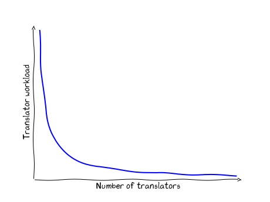

============
Coordinating
============

Information about the Python documentation translation processes is
found on this page and in :PEP:`545`. Translations are overseen by the
`Editorial Board <EB_>`_.

.. _translation-help:

Communication/help channels
===========================

Discussions about translations occur on the Python Docs Discord
`#translations channel <https://discord.gg/h3qDwgyzga>`_, `translation
mailing list <translation_ml_>`_, and the
`translations category <trans_disc_>`_ of the Python Discourse.

For administrative issues, ping ``@python/editorial-board``.

Starting a new translation
==========================

Coordination is not a one-off task, it is a long-term commitment. Before
you start your translation, carefully consider if you will be able to commit
to this.
Every coordinator should be familiar with translating: see :ref:`translating`.

The following sections will guide you through setting up your translation.
If you have any questions or need help, ask in one of the
:ref:`help channels <translation-help>`.

Announcement
------------

Post an announcement introducing yourself and the translation you're
starting on `Discourse <trans_disc>`_. Also join the other communication
channels, if possible.

Coordination team
-----------------

Each translation team will decide on the number of coordinators.
While initially one person is fine, we recommend expanding to having two or
three coordinators. You can find more on choosing coordinators in the FAQ
section on this page.

Translation team
----------------

         decreases with the number of translators.

Gather people to translate with you. You can't do it alone.
Update :ref:`this table <translation-coordinators>` via a PR on the devguide
to make your translation easier to find. In the entry you can also include links
to guides or other resources for translators.

Repository
----------

To start your translation create a GitHub repository, under any
account, with the correct Git hierarchy and folder structure. This can be done
in several ways, and depends on what translation process you plan to use.

Each translation is assigned an appropriate lowercase
`IETF language tag <https://datatracker.ietf.org/doc/html/rfc5646.html>`_.
The tag may have an optional subtag, joined with a dash.
For example, ``pt`` (Portuguese) or ``pt-br`` (Brazilian Portuguese).
The repository name is then: ``python-docs-TAG``

The name of each branch should be the Python version it holds translations
for, for example, ``3.14``. The files should be structured like the source files
in `CPython/Doc <https://github.com/python/cpython/tree/main/Doc>`_.
A correctly set up repository looks like this:
`python-docs-pl <https://github.com/python/python-docs-pl/>`_

Below, the recommended ways for starting your repository are described. You can
choose another way if you like; it’s up to you.

Cookiecutter/bootstrapper
~~~~~~~~~~~~~~~~~~~~~~~~~

You can bootstrap your new translation by using the `cookiecutter
<https://github.com/python-docs-translations/python-docs-cookiecutter>`__ or
`bootstrapper <https://github.com/python-docs-translations/python-docs-bootstrapper>`__.
The repository can then be used with a pull-request based translation process.

Translation platform
~~~~~~~~~~~~~~~~~~~~

You can also start your translation using
`Transifex <https://explore.transifex.com/python-doc/python-newest/>`_.
This will allow you to translate via the web interface, and to use shared
automatically updated source files.

This is best done with a workflow that periodically checks for translations.
An example with instructions can be found in the
`python-docs-tx-automations documentation <https://python-docs-transifex-automation.readthedocs.io/workflows.html>`__.
An in-depth guide for manually doing this can also be found
in the same documentation's
`commands page <https://python-docs-transifex-automation.readthedocs.io/commands.html>`__.

To be added as coordinators on Transifex for your language, open an issue
in the `tracker <https://github.com/python-docs-translations/transifex-automations/issues>`__.

Glossary
--------

Each translation team should have a way to store translations of terms to ensure
consistency. This is often done with a glossary. More information about the use
of glossaries can be found in the :ref:`translation-style-guide`.

Moving the repo to the ``python`` org
-------------------------------------

This will allow you to plug your translation into docsbuild-scripts_, and it
will be found at ``docs.python.org/LANG/``, but not in the switcher.

.. TODO Give a general milestone when this will be done.

Adding to the language switcher
-------------------------------

.. TODO Specify branch: https://github.com/python/devguide/issues/1586

Once the following resources have been fully translated:

- ``bugs.po``, with proper links to the language repository issue tracker
- all files in the ``tutorial/`` folder
- ``library/functions.po``, the page documenting builtins

the translation can be added to the language switcher. This can be done with a
pull request to docsbuild-scripts_, like `this commit <https://github.com/python/docsbuild-scripts/commit/e4a8aff9772738a63d0945042777d18c3d926930>`__
if your translation was previously built but not in the switcher, or like
`this commit <https://github.com/python/docsbuild-scripts/commit/a601ce67c6c2f3be7fde3376d3e5d3851f19950b>`__
if this is it's initial addition.

PEP 545 summary
===============

Here are the essential points of :PEP:`545`:

- Each translation is assigned an appropriate lowercase
  `IETF language tag <https://datatracker.ietf.org/doc/html/rfc5646.html>`_.
  The tag may have an optional region subtag, joined with a dash.
  For example, ``pt`` (Portuguese) or ``pt-br`` (Brazilian Portuguese).

- Each translation is under CC0 and is marked as such in the README.

- Translation files are hosted in repositories under the Python org:
  ``https://github.com/python/python-docs-{LANGUAGE_TAG}``

- Translations having completed ``bugs``, ``tutorial/``
  and ``library/functions`` are added to the language switcher.

Translating Sphinx
==================

Some messages that appear in the docs must be translated in the
`Sphinx project <https://www.sphinx-doc.org/en/master/internals/contributing.html#translations>`__
(`sphinx-doc on Transifex <https://app.transifex.com/sphinx-doc/>`__) or in
the :ref:`Python Docs Sphinx Theme <python-docs-theme-i18n>`.
Coordinators should direct some translators there, so that the documentation
is fully translated.

Coordination FAQ
================

Are there tools to help in managing the repo?
---------------------------------------------

Here's what we're using:

- :pypi:`poutils` which includes:

  - :pypi:`pomerge` to propagate translations from one file to others.
  - :pypi:`pospell` to check for typos in ``.po`` files.
  - :pypi:`powrap` to rewrap the ``.po`` files
    before committing. This helps keep Git diffs short.
  - :pypi:`potodo` to list what needs to be translated.

- :pypi:`sphinx-lint` to validate reST syntax in translation files.

More related tools and projects can be found in the
`python-docs-translations`__ organisation on GitHub.

__ https://github.com/python-docs-translations

How should I test my translation?
---------------------------------

Testing should ideally be set up in your repository, and will help catch errors
early and ensure translation quality. Testing generally consists of building, and
linting with :pypi:`sphinx-lint`.

See `this documentation <https://python-docs-transifex-automation.readthedocs.io/workflows.html#test-build-workflow>`_
for sample workflows with usage guides.

The `dashboard <https://python-docs-translations.github.io/dashboard/metadata.html>`_
also tests translations and uploads error logs.

How is a coordination team chosen?
----------------------------------

Each translation team will decide on the number of coordinators.
We recommend two or three coordinators, though you may begin with one.

-  Coordinator requests are to be public on the `translation mailing list <translation_ml_>`_.
-  If the given language has a native core team member, they have input
   on the coordinator request.
-  Anyone who wants to become coordinator for their native language and shows
   motivation by translating and building a community will be named
   coordinator.
-  We expect the local community to self-organize coordinators and contributors.
   If you have questions, please ask on the mailing list or Discourse.
-  If a coordinator becomes inactive or unreachable for a long
   period of time, someone else can ask to be added as a primary coordinator on
   the `translation mailing list <translation_ml_>`_.
   As a community resource, we aim to keep translations up to date with active
   contributors, including coordinators.

I have a translation, but it's not in Git. What should I do?
------------------------------------------------------------

You can ask for help in one of the :ref:`translation-help`, and
the team will help you create an appropriate repository. You can still use tools
like Transifex, if you like.

My Git hierarchy does not match yours. Can I keep it?
-----------------------------------------------------

No, inside the ``github.com/python`` organization all repositories must have the
exact same hierarchy so bots will be able to build all of our
translations. So, you may have to convert from one hierarchy to another.
Ask for help in one of the :ref:`translation-help` if you’re not sure on how to
do it.

What hierarchy should I use in my GitHub repository?
----------------------------------------------------

As for every project, we have a *branch* per version.  We store ``.po``
files in the root of the repository using the ``gettext_compact=0``
style.

Which version of the Python documentation should be translated?
---------------------------------------------------------------

It's best to work on Python's current stable or beta version. You can then
propagate your translation from one branch to another using :pypi:`pomerge`.

The entry for my translation is missing or not up to date
---------------------------------------------------------

Make a PR on the `devguide <https://github.com/python/devguide/>`__ to update it.

How are translations built?
---------------------------

Translations are built by `docsbuild-scripts <https://github.com/python/docsbuild-scripts/>`__
and hosted on docs.python.org.

Is there a Weblate instance we can translate on?
------------------------------------------------

There is currently no Weblate instance for Python translations.
See this `Discourse thread <https://discuss.python.org/t/docs-translation-platform/29940>`_
for updates.

.. _EB: https://python.github.io/editorial-board/
.. _translation_ml: https://mail.python.org/mailman3/lists/translation.python.org/
.. _trans_disc: https://discuss.python.org/c/documentation/translations/
.. _docsbuild-scripts: https://github.com/python/docsbuild-scripts
