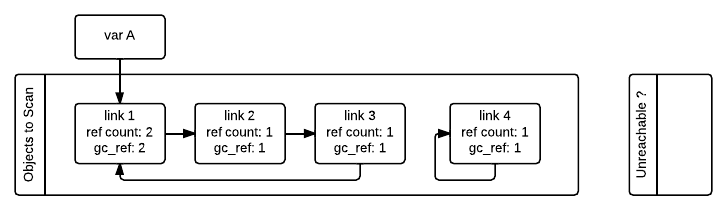
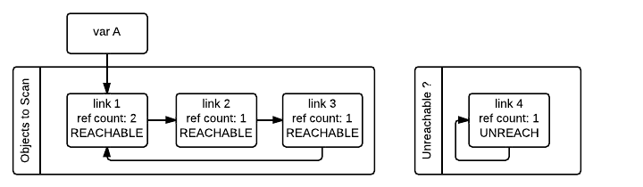

.. _gc:

Design of CPython's Garbage Collector
=====================================

.. highlight:: none

Abstract
--------

The main garbage collector system of CPython is reference count. The basic idea is
that CPython counts how many different places there are that have a reference to an
object. Such a place could be another object, or a global (or static) C variable, or
a local variable in some C function. When an object’s reference count becomes zero,
the object is deallocated. If it contains references to other objects, their
reference count is decremented. Those other objects may be deallocated in turn, if
this decrement makes their reference count become zero, and so on. The reference
count field can be examined using the ``sys.getrefcount`` function (notice that the
value returned by this function is always 1 more as the function also has a reference
to the object when called):

.. code-block:: python

    >>> x = object()
    >>> sys.getrefcount(x)
    2
    >>> y = x
    >>> sys.getrefcount(x)
    3
    del y
    >>> sys.getrefcount(x)
    2

The main problem present with the reference count schema is that reference count does not
handle reference cycles. For instance, consider this code:

.. code-block:: python

    >>> container = []
    >>> container.append(container)
    >>> sys.getrefcount(container)
    3
    >>> del container

In this example, ``container`` holds a reference to itself, so even when we remove
our reference to it (the variable "container") the reference count never falls to 0
because it still has its own internal reference and therefore it will never be
cleaned just by simple reference counting. For this reason some additional machinery
is needed to clean these reference cycles between objects once they become
unreachable. We normally refer to this additional machinery as the Garbage Collector,
but technically reference counting is also a form of garbage collection.

Memory layout and object structure
----------------------------------

Normally the C structure supporting a regular Python object looks as follows:

.. code-block:: none

    object -----> +--+--+--+--+--+--+--+--+--+--+--+--+--+--+--+--+ \
                  |                    ob_refcnt                  | |
                  +--+--+--+--+--+--+--+--+--+--+--+--+--+--+--+--+ | PyObject_HEAD
                  |                    *ob_type                   | |
                  +--+--+--+--+--+--+--+--+--+--+--+--+--+--+--+--+ /
                  |                      ...                      |
                  

In order to support the garbage collector, the memory layout of objects is altered
to accommodate extra information **before** the normal layout:

.. code-block:: none

                  +--+--+--+--+--+--+--+--+--+--+--+--+--+--+--+--+ \
                  |                    *_gc_next                  | |
                  +--+--+--+--+--+--+--+--+--+--+--+--+--+--+--+--+ | PyGC_Head
                  |                    *_gc_prev                  | |
    object -----> +--+--+--+--+--+--+--+--+--+--+--+--+--+--+--+--+ /
                  |                    ob_refcnt                  | \
                  +--+--+--+--+--+--+--+--+--+--+--+--+--+--+--+--+ | PyObject_HEAD
                  |                    *ob_type                   | |
                  +--+--+--+--+--+--+--+--+--+--+--+--+--+--+--+--+ /
                  |                      ...                      |
                  

In this way the object can be treated as a normal python object and when the extra
information associated to the GC is needed the previous fields can be accessed by a
simple type cast from the original object: :code:`((PyGC_Head *)(the_object)-1)`.

As is explained later in the `Optimization: reusing fields to save memory`_ section,
these two extra fields are normally used to keep doubly linked lists of all the
objects tracked by the garbage collector (these lists are the GC generations, more on
that in the `Optimization: reusing fields to save memory`_ section), but they are also
reused to fullfill other pourposes when the full double linked list structure is not
needed as a memory optimization.

Doubly linked lists are used because they efficiently support most frequently required operations.  In
general, the collection of all objects tracked by GC are partitioned into disjoint sets, each in its own
doubly linked list.  Between collections, objects are partitioned into "generations", reflecting how
often they're survived collection attempts.  During collections, the generations(s) being collected
are further partitioned into, e.g., sets of reachable and unreachable objects.  Doubly linked lists
support moving an object from one partition to another, adding a new object,  removing an object
entirely (objects tracked by GC are most often reclaimed by the refcounting system when GC
isn't running at all!), and merging partitions, all with a small constant number of pointer updates.

Specific APIs are offered to allocate, deallocate, initialize, track, and untrack
objects with GC support. These APIs can be found in the `Garbage Collector C API
documentation <https://docs.python.org/3.8/c-api/gcsupport.html>`_.

Apart from this object structure, the type object for objects supporting garbage
collection must include the ``Py_TPFLAGS_HAVE_GC`` in its ``tp_flags`` slot and
provide an implementation of the ``tp_traverse`` handler. Unless it can be proven
that the objects cannot form reference cycles with only objects of its type or if the
type is immutable, a ``tp_clear`` implementation must also be provided.


Identifiying reference cycles reference cycles
----------------------------------------------

The algorithm that CPython uses to detect those reference cycles is
implemented in the ``gc`` module. The garbage collector **only focuses**
on cleaning container objects (i.e. objects that can contain a reference
to one or more objects). These can be arrays, dictionaries, lists, custom
class instances, classes in extension modules, etc. One could think that
cycles are uncommon but the truth is that many internal references needed by
the interpreter create cycles everywhere. Some notable examples:

    * Exceptions contain traceback objects that contain a list of frames that
      contain the exception itself.
    * Instances have references to their class which itself references its module, and the module
      contains references to everything that is inside (and maybe other modules)
      and this can lead back to the original instance.
    * When representing data structures like graphs, it is very typical for them to
      have internal links to themselves.

To correctly dispose of these objects once they become unreachable, they need to be
identified first.  Inside the function that identifies cycles, two double-linked
lists are maintained: one list contains all objects to be scanned, and the other will
contain all objects "tentatively" unreachable.

To understand how the algorithm works, Let’s take the case of a circular linked list
which has one link referenced by a variable A, and one self-referencing object which
is completely unreachable

.. code-block:: python

    >>> import gc

    >>> class Link:
    ...    def __init__(self, next_link=None):
    ...        self.next_link = next_link

    >>> link_3 = Link()
    >>> link_2 = Link(link3)
    >>> link_1 = Link(link2)
    >>> link_3.next_link = link_1

    >>> link_4 = Link()
    >>> link_4.next_link = link_4

    >>> del link_4
    >>> gc.collect()
    2

When the GC starts, it has all the container objects it wants to scan
on the first linked list. The objective is to move all the unreachable
objects. Since most objects turn out to be reachable, it is much more
efficient to move the unreachable as this involves fewer pointer updates.

Every object that supports garbage collection will have an extra reference
count field initialized to the reference count (``gc_ref`` in the figures)
of that object when the algorithm starts. This is because the algorithm needs
to modify the reference count to do the computations and in this way the
interpreter will not modify the real reference count field. 



The GC then iterates over all containers in the first list and decrements by one the
``gc_ref`` field of any other object that container is referencing.  Doing
this makes use of the ``tp_traverse`` slot in the container class (implemented
using the C API or inherited by a superclass) to know what objects are referenced by
each container. After all the objects have been scanned, only the objects that have
references from outside the “objects to scan” list will have ``gc_ref > 0``.

.. figure:: images/python-cyclic-gc-2-new-page.png

Notice that having ``gc_refs == 0`` does not imply that the object is unreachable.
This is because another object that is reachable from the outside (``gc_refs > 0``)
can still have references to it. For instance, the ``link_2`` object in our example
ended having ``gc_refs == 0`` but is referenced still by the ``link_1`` object that
is reachable from the outside. To obtain the set of objects that are really
unreachable, the garbage collector scans again the container objects using the
``tp_traverse`` slot with a different traverse function that marks objects with
``gc_refs == 0`` as "tentatively unreachable" and then moves them to the
tentatively unreachable list. The following image depicts the state of the lists in a
moment when the GC processed the ``link 3`` and ``link 4`` objects but has not
processed ``link 1`` and ``link 2`` yet.

.. figure:: images/python-cyclic-gc-3-new-page.png

Then the GC scans the next ``link 1`` object. Because its has ``gc_refs == 1``
the gc does not do anything special because it knows it has to be reachable (and is
already in what will become the reachable list):

.. figure:: images/python-cyclic-gc-4-new-page.png

When the GC encounters an object which is reachable (``gc_refs > 0``), it traverses
its references using the ``tp_traverse`` slot to find all the objects that are
reachable from it, moving them to the end of the list of reachable objects (where
they started originally) and setting its ``gc_refs`` field to 1. This is what happens
to ``link 2`` and ``link 3`` below as they are reachable from ``link 1``.  From the
state in the previous image and after examining the objects referred to by ``link1``
the GC knows that ``link 3`` is reachable after all, so it is moved back to the
original list and its ``gc_refs`` field is set to one so if the GC visits it again, it
does know that is reachable. To avoid visiting a object twice, the GC marks all
objects that are not visited yet with and once an object is processed is unmarked so
the GC does not process it twice.



Notice that once a object that was marked as "tentatively unreachable" and later is
moved back to the reachable list, it will be visited again by the garbage collector
as now all the references that that objects has need to be processed as well. This
process in really a breadth first search over the object graph. Once all the objects
are scanned, the GC knows that all container objects in the tentatively unreachable
list are really unreachable and can thus be garbage collected.

Why moving unreachable objects is better
~~~~~~~~~~~~~~~~~~~~~~~~~~~~~~~~~~~~~~~~

It sounds logical to move the unreachable objects under the premise that most objects
are usually reachable, until you think about it: the reason it pays isn't actually
obvious.

Suppose we create objects A, B, C in that order. They appear in the young generation
in the same order. If B points to A, and C to B, and C is reachable from outside,
then the adjusted refcounts after the first step of the algorith runs will be 0, 0,
and 1 respectively because the only reachable object from the outside is C.

When the next step of the algorithm finds A, A is moved to the unreachable list. The
same for B when it's first encountered. Then C is traversed, B is moved *back* to
the reachable list. B is eventually traversed, and then A is moved back to the reachable
list.

So instead of not moving at all, the reachable objects B and A are each moved twice.
Why is this a win? A straightforward algorithm to move the reachable objects instead
would move A, B, and C once each. The key is that this dance leaves the objects in
order C, B, A - it's reversed from the original order.  On all *subsequent* scans,
none of them will move.  Since most objects aren't in cycles, this can save an
unbounded number of moves across an unbounded number of later collections. The only
time the cost can be higher is the first time the chain is scanned.

Destroying unreachable objects
------------------------------

Once the GC knows the list of unreachable objects, a very delicate process starts
with the objective of completely destroying these objects. Roughly, the process
follows these steps in order:

1. Handle and clean weak references (if any). If an object that is in the unreachable
   set is going to be destroyed and has weak references with callbacks, these
   callbacks need to be honored. This process is **very** delicate as any error can
   cause objects that will be in an inconsistent state to be resurrected or reached
   by some python functions invoked from the callbacks. To avoid this weak references
   that also are part of the unreachable set (the object and its weak reference
   are in a cycles that are unreachable) then the weak reference needs to be clean
   immediately and the callback must not be executed so it does not trigger later
   when the ``tp_clear`` slot is called, causing havoc. This is fine because both
   the object and the weakref are going away, so it's legitimate to pretend the
   weak reference is going away first so the callback is never executed.

2. If an object has legacy finalizers (``tp_del`` slot) move them to the
   ``gc.garbage`` list.
3. Call the finalizers (``tp_finalize`` slot) and mark the objects as already
   finalized to avoid calling them twice if they resurrect of if other finalizers
   have removed the object first.
4. Deal with resurrected objects. If some objects have been resurrected the GC
   finds the new subset of objects that are still unreachable by running the cycle
   detection algorithm again and continues with them.
5. Call the ``tp_clear`` slot of every object so all internal links are broken and
   the reference counts fall to 0, triggering the destruction of all unreachable
   objects.

Optimization: generations
-------------------------

In order to limit the time each garbage collection takes, the GC is uses a popular
optimization: generations. The main idea behind this concept is the assumption that
most objects have a very short lifespan and can thus be collected shortly after their
creation. This has proven to be very close to the reality of many Python programs as
many temporary objects are created and destroyed very fast. The older an object is
the less likely is to become unreachable.

To take advantage of this fact, all container objects are segregated across
three spaces/generations. Every new
object starts in the first generation (generation 0). The previous algorithm is
executed only over the objects of a particular generation and if an object
survives a collection of its generation it will be moved to the next one
(generation 1), where it will be surveyed for collection less often. If
the same object survives another GC round in this new generation (generation 1)
it will be moved to the last generation (generation 2) where it will be
surveyed the least often.

Generations are collected when the number of objects that they contain reach some
predefined threshold which is unique of each generation and is lower than the older
generations are. These thresholds can be examined using the  ``gc.get_threshold``
function:

.. code-block:: python

    >>> import gc
    >>> gc.get_threshold()
    (700, 10, 10)


The content of these generations can be examined using the
``gc.get_objects(generation=NUM)`` function and collections can be triggered
specifically in a generation by calling ``gc.collect(generation=NUM)``.

.. code-block:: python

    >>> import gc
    >>> class MyObj:
    ...     pass
    ... 

    # Move everything to the last generation so its easier to inspect
    # the younger generations.

    >>> gc.collect()
    0

    # Create a reference cycle

    >>> x = MyObj()
    >>> x.self = x

    # Initially the object is in the younguest generation.

    >>> gc.get_objects(generation=0)
    [..., <__main__.MyObj object at 0x7fbcc12a3400>, ...]

    # After a collection of the younguest generation the object
    # moves to the next generation.

    >>> gc.collect(generation=0)
    0
    >>> gc.get_objects(generation=0)
    []
    >>> gc.get_objects(generation=1)
    [..., <__main__.MyObj object at 0x7fbcc12a3400>, ...]


Collecting the oldest generation
~~~~~~~~~~~~~~~~~~~~~~~~~~~~~~~~

In addition to the various configurable thresholds, the GC only triggers a full
collection of the oldest generation if the ratio ``long_lived_pending / long_lived_total``
is above a given value (hardwired to 25%). The reason is that, while "non-full"
collections (i.e., collections of the young and middle generations) will always
examine roughly the same number of objects (determined by the aforementioned
thresholds) the cost of a full collection is proportional to the total
number of long-lived objects, which is virtually unbounded.  Indeed, it has
been remarked that doing a full collection every <constant number> of object
creations entails a dramatic performance degradation in workloads which consist
of creating and storing lots of long-lived objects (e.g. building a large list
of GC-tracked objects would show quadratic performance, instead of linear as
expected). Using the above ratio, instead, yields amortized linear performance
in the total number of objects (the effect of which can be summarized thusly:
"each full garbage collection is more and more costly as the number of objects
grows, but we do fewer and fewer of them").

Optimization: reusing fields to save memory
-------------------------------------------

In order to save memory, the two linked list pointers in every object with GC
support are reused for several purposes. This is a common optimization known
as "fat pointers" or "tagged pointers": pointers that carry additional data,
"folded" into the pointer, meaning stored inline in the data representing the
address, taking advantage of certain properties of memory addressing. This is
possible as most architectures are certain types of data will often be aligned
to the size of the data, often a word or multiple thereof. This discrepancy
leaves a few of the least significant bits of the pointer unused, which can be
used for tags or to keep other information – most often as a bit field (each
bit a separate tag) – as long as code that uses the pointer masks out these
bits before accessing memory.  E.g., on a 32-bit architecture (for both
addresses and word size), a word is 32 bits = 4 bytes, so word-aligned
addresses are always a multiple of 4, hence end in ``00``, leaving the last 2 bits
available; while on a 64-bit architecture, a word is 64 bits word = 8 bytes, so
word-aligned addresses end in ``000``, leaving the last 3 bits available.

The CPython GC makes use of two fat pointers:

* Between collections, the ``_gc_prev``` field is used as the "previous"
  pointer to maintain the doubly linked list but the lowest two bits of are used
  to keep some flags like `PREV_MASK_COLLECTING`. During collections ``_gc_prev``
  is temporary used for storing the temporary copy of the reference count
  (``gc_refs``) , and the GC linked list becomes a singly linked list until
  ``_gc_prev`` is restored.

* The ``_gc_next`` field is used as the "next" pointer to maintain the doubly
  linked list but during its lowest bit is used to keep the
  ``NEXT_MASK_UNREACHABLE`` flag that indicates if an object is tentatively
  unreachable during the cycle detection algorithm.

Optimization: delay tracking containers
---------------------------------------

Certain types of containers cannot participate in a reference cycle, and so do
not need to be tracked by the garbage collector. Untracking these objects
reduces the cost of garbage collections. However, determining which objects may
be untracked is not free, and the costs must be weighed against the benefits
for garbage collection. There are two possible strategies for when to untrack
a container:

1. When the container is created.
2. When the container is examined by the garbage collector.

As a general rule, instances of atomic types aren't tracked and instances of
non-atomic types (containers, user-defined objects...) are.  However, some
type-specific optimizations can be present in order to suppress the garbage
collector footprint of simple instances. Some examples of native types that
benefit from delayed tracking:

* Tuples containing only immutable objects (integers, strings etc,
  and recursively, tuples of immutable objects) do not need to be tracked. The
  interpreter creates a large number of tuples, many of which will not survive
  until garbage collection. It is therefore not worthwhile to untrack eligible
  tuples at creation time. Instead, all tuples except the empty tuple are tracked
  when created. During garbage collection it is determined whether any surviving
  tuples can be untracked. A tuple can be untracked if all of its contents are
  already not tracked. Tuples are examined for untracking in all garbage collection
  cycles. It may take more than one cycle to untrack a tuple. 

* Dictionaries containing only immutable objects also do not need to be tracked.
  Dictionaries are untracked when created. If a tracked item is inserted into a
  dictionary (either as a key or value), the dictionary becomes tracked. During a
  full garbage collection (all generations), the collector will untrack any dictionaries
  whose contents are not tracked.

The garbage collector module provides the python function is_tracked(obj), which returns
the current tracking status of the object. Subsequent garbage collections may change the
tracking status of the object. 

.. code-block:: python

      >>> gc.is_tracked(0)
      False
      >>> gc.is_tracked("a")
      False
      >>> gc.is_tracked([])
      True
      >>> gc.is_tracked({})
      False
      >>> gc.is_tracked({"a": 1})
      False
      >>> gc.is_tracked({"a": []})
      True
